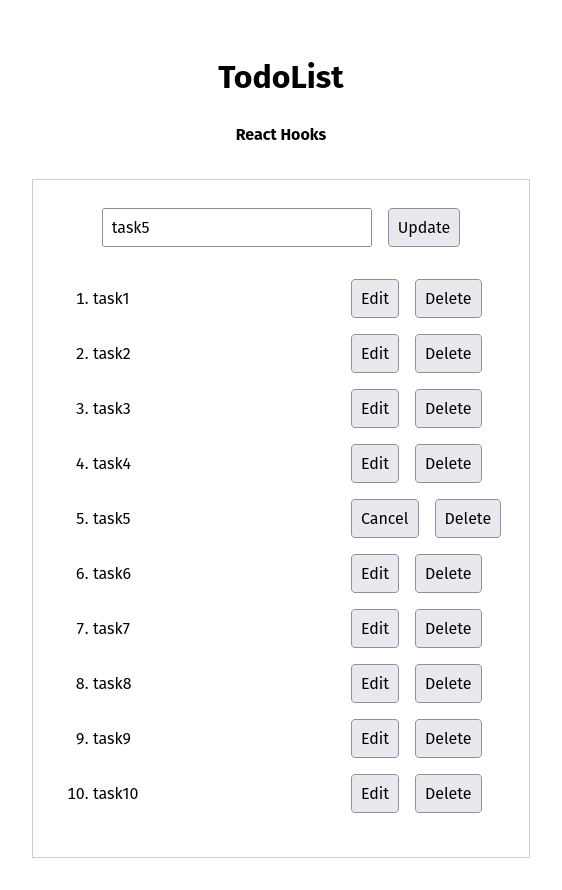

# 🧩 Itération 001 — CRUD de base

Première étape du projet **TodoList Web**, centrée sur la création d’une application simple permettant d’ajouter, modifier et supprimer des tâches.

<p align="center">
  
</p>

## 🎯 Objectifs

- Comprendre les bases de **React et Hooks** (`useState`, `useRef`).
- Implémenter les opérations **CRUD** :
  - Create
  - Read
  - Update
  - Delete
- Gérer le focus et les raccourcis clavier (Enter / Escape).

## 🧠 Points clés

- Pas de dépendance externe.
- Manipulation du **state local**.
- Séparation claire des fonctions de gestion.
- Persistance en mémoire (pas encore de stockage local).

## 🚀 Lancer le projet

```bash
npm install
npm run dev
```
