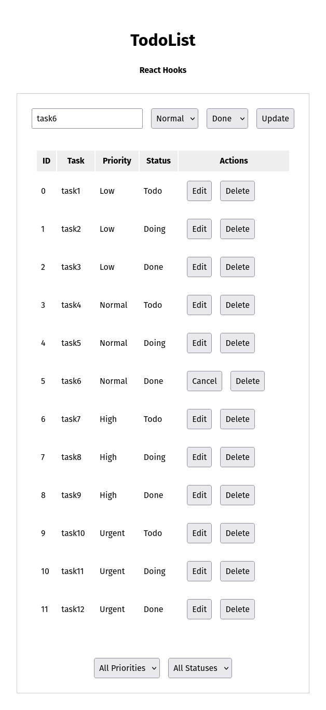

# ⚙️ Itération 002 — Priorité, Statut, Tri & Filtrage

Deuxième étape du projet **TodoList Web**.
L’application s’enrichit de fonctionnalités de gestion avancée des tâches : **priorité, statut, tri et filtres dynamiques.**

<p align="center">
  
</p>

## 🎯 Objectifs

- Ajouter des champs métier pour chaque tâche :
  - **Priorité** : Low / Normal / High / Urgent
  - **Statut** : Todo / Doing / Done
- Implémenter :
  - **Tri (Sorting)** sur toutes les colonnes (ID, nom, priorité, statut)
  - **Filtrage (Filtering)** par priorité et statut
- Introduire un affichage tabulaire clair et ergonomique.
- Préparer la structure pour la future gestion d’état globale.

## 🧠 Concepts clés

- États imbriqués et objets complexes (`{ id, name, priority, status }`)
- Filtres combinés via deux `select`
- Fonction de tri paramétrable
- Gestion contrôlée des inputs et menus déroulants
- **Double stockage (`tasks` / `allTasks`)** :
  - `tasks` contient les données actuellement affichées (triées ou filtrées)
  - `allTasks` conserve toutes les tâches originales pour permettre :
    - de **réinitialiser les filtres** facilement
    - d’**annuler une édition** via le bouton **Cancel**
  - Ce pattern illustre la séparation entre **vue dérivée** et **source de vérité**,
    principe fondamental avant de passer à une gestion d’état centralisée.

```
User Actions
↓
┌──────────────┐
│ allTasks │ ← toutes les données (source)
└──────────────┘
↓ filtres / tris
┌──────────────┐
│ tasks │ ← affichage actuel
└──────────────┘
```

## 🚀 Lancer le projet

```bash
npm install
npm run dev
```
