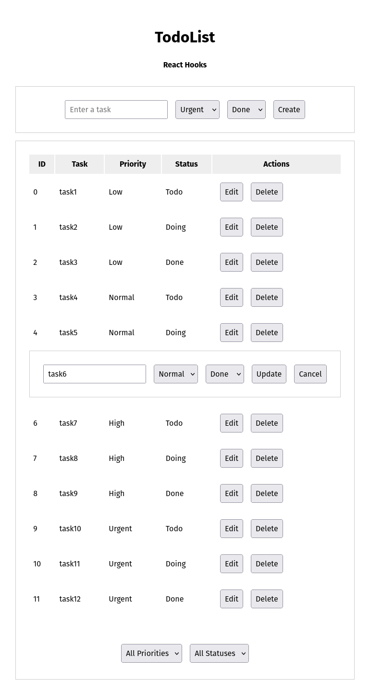

# 🧱 Itération 003 — Structuration en composants

Troisième étape du projet **TodoList Web**.
L’application est désormais **découpée en composants réutilisables**, chacun responsable d’une partie de la logique (création, affichage, édition).

<p align="center">
  
</p>

## 🎯 Objectifs

- Séparer l’application en **composants fonctionnels indépendants** :
  - `TaskApp` → composant racine, gestion globale des tâches et des états.
  - `TaskCreate` → formulaire de création de tâche.
  - `TaskList` → affichage des tâches, tri, filtres et actions.
  - `TaskEdit` → édition inline des tâches.
- Conserver la logique de la variable globale `allTasks` pour :
  - **préserver les données d’origine** (source de vérité),
  - permettre l’**annulation d’une modification** (bouton *Cancel*).
- Rendre l’application plus lisible, modulaire et prête à évoluer.

## 🧠 Concepts clés

- **Découpage logique** : chaque composant a une responsabilité unique.
- **Communication parent → enfant** via les props (`onCreate`, `onUpdate`, `onDelete`, `onSort`, `onFilter`, `onCancel`).
- **Rendu conditionnel** dans `TaskList` :
  - affichage normal de la ligne,
  - ou bascule vers `TaskEdit` lors d’une édition inline.
- **Double état (`tasks` / `allTasks`)** :
  - `tasks` : vue actuelle (filtrée, triée ou en édition),
  - `allTasks` : source complète (toutes les données).
  - Le bouton **Cancel** recharge la vue depuis `allTasks` pour annuler toute modification en cours.
- **Réutilisation d’état** :
  - `TaskCreate` mémorise la dernière priorité et le dernier statut utilisés.
  - `TaskEdit` initialise automatiquement ses valeurs à partir de la tâche sélectionnée.
- **Immutabilité** : chaque mise à jour crée de nouvelles copies (`map`, `filter`, `...`).

## 🧩 Fonctionnalités actives

- Création rapide de tâches avec mémorisation des derniers paramètres.
- Affichage tabulaire avec tri sur chaque colonne.
- Filtres combinés par priorité et statut.
- Édition inline d’une tâche (nom, priorité, statut).
- Annulation d’une édition sans perte de données (*Cancel*).
- Suppression immédiate d’une tâche.

## 🚀 Lancer le projet

```bash
npm install
npm run dev
```
