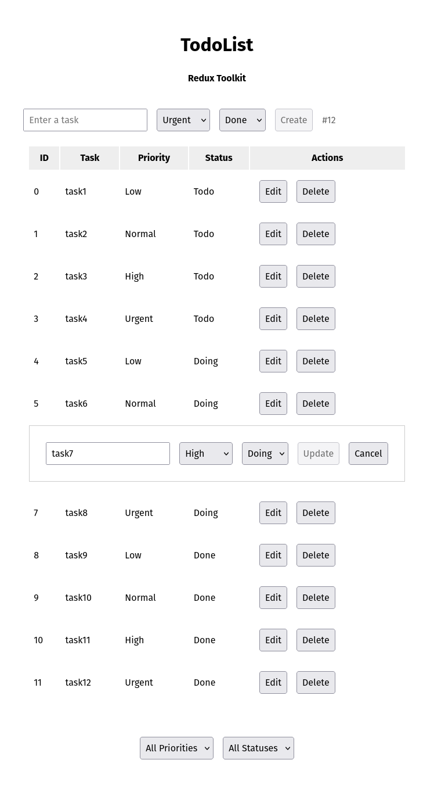

# 🦋 Itération 005 – Intégration de Redux Toolkit

Cette itération introduit **Redux Toolkit** pour centraliser la logique d’état de l’application TodoList.
L’objectif était de remplacer le `useState` local par un store global robuste, tout en conservant le comportement initial (création, édition, suppression, tri, filtrage, annulation).

  

## 🎯 Objectif

- Simplifier la gestion de l’état global.
- Mieux isoler la logique métier (via des *slices*).
- Faciliter la maintenance et les futures évolutions (ex : persistance, tests unitaires).

## 🧩 Modifications principales

- Création du **slice** `tasksSlice.ts` :
  - contient la source de vérité (`all`) et la vue filtrée/triée (`view`)
  - gère la création, mise à jour, suppression, tri, filtrage et annulation
- Mise en place du **store Redux** (`store/index.ts`)
- Ajout des **hooks typés** (`useAppDispatch`, `useAppSelector`)
- Simplification des composants :
  - `TaskApp` → shell minimal
  - `TaskCreate` → dispatch direct des actions `createTask`
  - `TaskList` → lecture via `useAppSelector`, actions de tri et filtre
  - `TaskEdit` → édition et annulation pilotées par Redux

## ⚙️ Avantages

- **Code plus clair et prévisible**
- **Gestion centralisée** de l’état et des filtres
- **Annulation instantanée** via rollback depuis la source
- **Prêt pour la persistance locale (localStorage)** ou serveur futur

## ✅ Statut

Implémentation terminée et fonctionnelle.
Prochaine étape : intégration de **tests unitaires Redux** et **persistence** des tâches.
